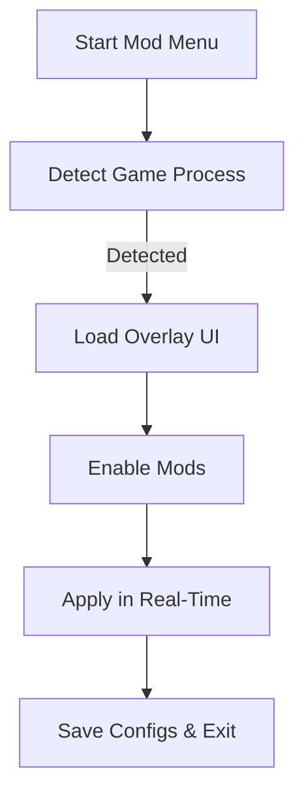

# 🧛 Vampire: The Masquerade - Bloodlines 2 Mod Menu

Rule the night your way with the **Vampire: The Masquerade - Bloodlines 2 Mod Menu**, a next-generation customization tool that lets you fine-tune every aspect of your vampiric experience. From discipline amplifiers and stealth enhancements to visual overlays and clan-specific power scaling — this tool gives players absolute freedom to play beyond mortal limits.

Whether you favor brutal Brujah combat or the elegant persuasion of the Toreador, the Mod Menu adapts to every playstyle and scenario — seamlessly integrated into both Steam and Epic versions of the game.

---

## 👁 Overview

The Mod Menu runs as a dynamic in-game overlay, built for smooth, real-time toggles. It doesn’t rewrite files or need permanent injection — simply load it, activate your favorite mods, and feed your power hunger instantly.

| Function                 | Description                                        | Default Key |
| ------------------------ | -------------------------------------------------- | ----------- |
| 🩸 Infinite Vitae        | Endless blood energy for all disciplines           | F1          |
| ⚔️ God Mode              | Immortality across all zones                       | F2          |
| 🧠 Max Dialogue Skill    | Win persuasion, intimidation, and seduction checks | F3          |
| 👁 Wall Vision (ESP)     | See NPCs, loot, and traps through walls            | F4          |
| ⚡ Instant Cooldowns      | Spam powers with zero delay                        | F5          |
| 💀 Discipline Multiplier | Boost all vampiric abilities                       | F6          |
| 🕶 Stealth Cloak         | Total invisibility in shadows                      | F7          |

---

## ⚙️ Features

* **Clan Configurator:** Adjust base stats, XP gain, or unlock hybrid bloodlines.
* **Dynamic ESP Overlay:** Identify targets, loot, and mission markers in real-time.
* **Realistic Shadows:** Enhance immersion with advanced dark balance rendering.
* **Performance Mode:** Locks at 120 FPS with optimized memory streaming.
* **Universal Keybind Editor:** Modify all inputs via `menu.cfg`.
* **Auto-Backup System:** Creates restore points before applying each mod set.

[!NOTE]
Each discipline effect can be tuned individually — including intensity multipliers and cooldown sliders.

---

## 🧩 Compatibility Table

| Platform             | Support        |
| -------------------- | -------------- |
| Windows 10 / 11      | ✅ Full         |
| Steam Build          | ✅ Tested       |
| Epic Games Build     | ✅ Tested       |
| Linux (Proton)       | ⚠️ Partial     |
| Controller Input     | ✅ Mapped       |
| Anti-Cheat Safe Mode | ✅ Offline Only |

[!IMPORTANT]
Always use the **Offline Mode** for Mod Menu features. Online use is not supported.

---

## ⚡ Quick Setup

1. **Download & Extract**
   Move the Mod Menu folder into your *Bloodlines 2* root directory.

2. **Launch Sequence**
   Run `Bloodlines2ModMenu.exe` before starting the game.

3. **Activate Menu In-Game**
   Press `INSERT` to open the overlay. Use arrow keys or mouse navigation.

4. **Save Configuration**
   Press `Ctrl + S` to store your preferred layout and hotkey settings.

```bash
# Example directory setup
C:\Games\Bloodlines2\
│
├── Bloodlines2.exe
├── Bloodlines2ModMenu.exe
└── menu.cfg
```

---

## 🕸 Visual Flow



---

## 🧠 Advanced Modules

* **Visual ESP:** Highlights hostile entities and interactables in customizable colors.
* **Blood Surge Control:** Adjust vitae regeneration speed.
* **Dialogue Dominance:** Automatically picks optimal persuasion choices.
* **Safe Zone Overrides:** Toggle feeding or combat even in restricted areas.
* **FPS Boost Preset:** Minimizes clutter and VFX during massive NPC encounters.

[!WARNING]
Activating all modules simultaneously may cause visual distortion in HDR mode. Enable features selectively for best performance.

---

## ❓ FAQ

**Q1: Does the Mod Menu affect achievements?**
A: When used offline, achievements remain unaffected. Online progression may be blocked when toggled.

**Q2: Can I use it with other mods?**
A: Yes. The menu supports layering with most `.pak` or `.ini` mods — it prioritizes runtime injection only.

**Q3: Is it detected by anti-cheat?**
A: It’s completely **safe for offline play**. Avoid multiplayer environments to stay compliant.

**Q4: Can I add my own scripts?**
A: Absolutely — the `scripts` folder allows `.lua` and `.ini` extensions with instant reload support.

**Q5: How do I remove it?**
A: Simply delete the Mod Menu folder. No residual registry keys or dependencies remain.

---

## 🎯 Pro Tips

* Combine **ESP + Stealth Cloak** for predator-level awareness.
* Adjust **FOV** in `menu.cfg` to enhance first-person immersion.
* Enable **Discipline Multiplier x3** for boss duels to feel godlike.
* Use **Dialogue Max + Persuasion Buff** for full social dominance.

[!TIP]
Run in borderless fullscreen for smoother overlay rendering.

---

## 🦇 Final Thoughts

The **Vampire: The Masquerade - Bloodlines 2 Mod Menu** gives you the freedom to rewrite your undead destiny. Whether you’re optimizing combat, exploring every dialogue path, or simply testing your clan’s powers to the fullest — this mod transforms *Bloodlines 2* into a sandbox of limitless potential.

---

**Rule the dark. Shape your story.**
*Activate the Mod Menu and unleash your true vampiric power today.*
